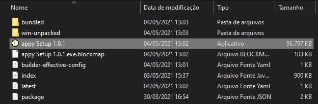

# Appy manual

> [!WARNING]
> O manual está sendo migrado do README.md para o site.

Essa página contém o manual de usuário do programa Appy. Você pode procurar as informações direto nessa página ou acessar os arquivos para download em [manual.docx](data/manual/manual.docx) ou [manual.pdf](data/manual/manual.pdf).

  
Conteúdo

- [Capítulo 1 - Primeiros passos no appy](#capítulo-1---primeiros-passos-no-appy)

  - [1.1 Realizando o download do appy](#11-realizando-o-download-do-appy)

    - [1.1.1 Google Drive](#111-google-drive)
    - [1.1.2 GitHub](#112-github)

  - [1.2 Instalando o appy](#12-instalando-o-appy)

    - [1.3 Interface gráfica do appy](#13-interface-gráfica-do-appy)

    - [1.3.1 Menu principal](#131-menu-principal)

    - [1.3.2 Menu lateral](#132-menu-lateral)

    - [1.3.3 Sistema de abas](#133-sistema-de-abas)

    - [1.3.4 Área de visualização](#134-área-de-visualização)

- [Capítulo 2 - Configurando um projeto appy](#capítulo-2---configurando-um-projeto-appy)

  - [2.1 Criando um novo projeto appy](#21-criando-um-novo-projeto-appy)

  - [2.2 Carregando um projeto appy existente](#22-carregando-um-projeto-appy-existente)

- [Capítulo 3 - Importar dados](#capítulo-3---importar-dados)

  - [3.1 Importar arquivos \*.las](#31-importar-arquivos-las)

- [Capítulo 4 - Exportar dados](#capítulo-4---exportar-dados)

  - [4.1 Exportar arquivos \*.las](#41-exportar-arquivos-las)

- [Capítulo 5 - LogPlot](#capítulo-5---logplot)

  - [5.1 Logplot via template](#51-logplot-via-template)

  - [5.2 Logplot customizado](#52-logplot-customizado)

- [Capítulo 6 - CrossPlots](#capítulo-6---crossplots)

- [Capítulo 7 - Comandos](#capítulo-7---comandos)

  - [7.1 Batch import LAS file](#71-batch-import-las-file)

  - [7.2 Calculadora de perfis](#72-calculadora-de-perfis)

  - [7.3 Cálculos de porosidade](#73-cálculos-de-porosidade)

    - [7.3.1 Porosidade pelo perfil densidade](#731-porosidade-pelo-perfil-densidade)

    - [7.3.2 Porosidade pelo perfil neutrão](#732-porosidade-pelo-perfil-neutrão)

    - [7.3.3 Porosidade Gaymard-Poupon](#733-porosidade-gaymard-poupon)

- [7.4 Cálculo do volume de argila](#74-cálculo-do-volume-de-argila)

- [7.5 Cálculo da saturação de água](#75-cálculo-da-saturação-de-água)

---

# Capítulo 1 - Primeiros passos no appy

Esse capítulo exemplifica como fazer o _download_ e a instalação do
appy. Em seguida, descreve algumas funcionalidades básicas da interface
gráfica.

Objetivos:

- _Download_ do appy;

- Instalação do appy;

- Resumo básico da interface gráfica do appy;

## 1.1 Realizando o download do appy

Existem duas formas de se obter o instalador do appy, sendo a primeira
por meio da pasta compartilhada do Google Drive, e a segunda a partir da
página do GIECAR no GitHub.

### 1.1.1 Google Drive

**Passo 1:** Acessar a pasta
[releases](https://drive.google.com/drive/folders/1SoTH8_St27u3s_d1_TXK6QwWQHECKO1C?usp=sharing).

**Passo 2:** Selecionar a versão mais recente e clicar com botão
direito.

**Passo 3:** Clicar no botão de "Download", para executar o download.

### 1.1.2 GitHub

## 1.2 Instalando o appy

**Passo 1:** Extrair o arquivo compactado obtido por meio do download
para qualquer diretório desejado.

**Passo 2:** Acessar a pasta "appy" criada.

**Passo 3:** Executar o arquivo "appy Setup 1.0.1".

**Passo 4:** Aguarde até que seja finalizada a instalação. Será criado
um atalho na Área de Trabalho e o appy será iniciado automaticamente.

## 1.3 Interface gráfica do appy

A interface gráfica do appy consiste nos seguintes componentes que serão
descritos a seguir:

- Menu principal: onde é acessado todos os comandos do appy.

- Menu lateral: onde é visualizado todas as informações do projeto
  carregado.

- Sistemas de abas: para navegar entre as diferentes visualizações.

- Área de visualização: área onde os objetos são apresentados, como os
  logplots e crossplots.

### 1.3.1 Menu principal

O menu principal do appy é localizado no topo da janela. Clicando em
cada botão do menu é visualizado o submenu correspondente. Os ícones na
extremidade direita do menu possibilita o appy ser minimizado,
maximizado e encerrado, respectivamente.

O menu principal inclui:

- File: para manipular os projetos.

- Import: para importar dados para o projeto carregado.

- Export: para exportar dados do projeto carregado.

- Plot: para criar visualizações, como os logplots e crossplots.

- Command: para executar comandos, como os cálculos petrofísicos.

### 1.3.2 Menu lateral

O menu lateral é localizado na parte esquerda da janela. O menu lateral
permite ao usuário interpretar os dados do projeto carregado por meio de
uma interface em formato de "árvore". Nessa versão do software, só é
possível visualizar as informações a respeito do poços importados, como
os grupos de perfis e os próprios perfis presentes nesses grupos.

### 1.3.3 Sistema de abas

O sistema de abas é localizado logo acima da área de visualização. É
responsável por apresentar todas as janelas abertas e clicando em cada
título é possível mover entre as diferentes visualizações. Clicando no
ícone do X, é possível fechar aquela janela em particular.

### 1.3.4 Área de visualização

A área de visualização é o componente principal do appy. Todos os
objetos criados a partir do resultado da execução de comandos são
apresentados nessa área, como por exemplo, logplots e crossplots.

# Capítulo 2 - Configurando um projeto appy

## 2.1 Criando um novo projeto appy

Para iniciar a utilização do appy, os usuários precisam criar um novo
projeto como primeiro passo. Todos os dados importados, os dados
processados, e as visualizações resultantes serão salvos dentro do
projeto.

**Passo 1:** No menu principal, clique no botão **FILE**.

**Passo 2:** Clique no botão **CREATE PROJECT**.

**Passo 3:** Uma nova janela será inicializada. Nela selecione o nome do
projeto e o diretório onde deseja salvar. Para navegar entre as pastas
do computador, o usuário pode clicar no ícone à direita. Em seguida,
clique no botão **OK**.

Quando finalizado, uma pasta será criada no caminho selecionado com
diversos arquivos padrões do projeto appy. Na tela, apresentará uma
janela informando que o projeto foi criado com sucesso.

## 2.2 Carregando um projeto appy existente

Com algum projeto appy já criado, é possível carregar esse projeto para
continuar a utilização do software.

**Passo 1:** No menu principal, clique no botão **FILE**.

**Passo 2:** Clique no botão **LOAD PROJECT**.

**Passo 3:** Uma nova janela será inicializada. Selecione o local onde o
projeto appy está. É possível navegar pelas pastas do computador,
clicando no ícone à direita. Em seguida, clique no botão **OK**.

Quando finalizado, todos os dados do projeto serão visualizados no menu
lateral, assim como, uma mensagem de que o projeto foi carregado com
sucesso.

# Capítulo 3 - Importar dados

## 3.1 Importar arquivos \*.las

Na versão atual do software appy, é possível apenas importar dados de
arquivo no formato LAS 2.0 (Log ASCII Format).

**Passo 1:** No menu principal, clique no botão **IMPORT**.

**Passo 2:** Clique no botão **IMPORT LAS FILE**.

**Passo 3:** Uma nova janela será inicializada. O primeiro parâmetro a
ser selecionado é o caminho do arquivo LAS. Para navegar pelas pastas do
computador, pode ser utilizado o ícone à direita.

**Passo 4:** No campo "Well name", selecione o nome do poço em que será
salvo os dados do arquivo LAS.

**Passo 5:** No campo "Well log set name", selecione o nome do grupo de
curvas em que será salvo os dados do arquivo LAS.

**Passo 6:** Clique no botão **OK**.

Quando finalizado, será adicionado o poço selecionado ao banco de dados
do projeto. As informações referentes a esse poço serão atualizadas no
menu lateral.

**IMPORTANTE:** Se o campo "Well name" não for preenchido, por padrão o
appy colocará o nome do poço contido no arquivo LAS. Se o campo "Well
log set name" não for preenchido, por padrão o appy nomeará de
"wireline".

# Capítulo 4 - Exportar dados

## 4.1 Exportar arquivos \*.las

Na versão atual do software appy, é possível apenas exportar dados para
arquivo no formato LAS 2.0 (Log ASCII Format).

**Passo 1:** No menu principal, clique no botão **EXPORT**.

**Passo 2:** Clique no botão **EXPORT LAS FILE**.

**Passo 3:** Uma nova janela será inicializada. O primeiro parâmetro a
ser selecionado é o caminho onde o arquivo LAS será salvo. Para navegar
pelas pastas do computador, pode ser utilizado o ícone à direita.

**Passo 4:** No campo "Well name", selecione o nome do poço presente no
banco de dados de onde os dados adquiridos para ser salvo no arquivo
LAS.

**Passo 5:** No campo "Well log set name", selecione o nome do grupo de
curvas, presente no poço selecionado anteriormente, de onde os dados
adquiridos para ser salvo no arquivo LAS.

**Passo 6:** Clique no botão **OK**.

# Capítulo 5 - LogPlot

O logplot é uma ferramenta fundamental para a avaliação de perfis, com
ela é possível visualizar diferentes tipos de dados, como por exemplo,
perfis, zonas, marcos, textos. Na versão atual do appy, é possível criar
um logplot a partir de um template previamente configurado e também um
customizado de acordo com as preferências do usuário.

## 5.1 Logplot via template

Uma das maneiras de criar um logplot no appy é a partir de um template.
Um template é um arquivo no formato .JSON que contém todas as
configurações de um gráfico logplot.

**Passo 1:** No menu principal, clique no botão **PLOT**.

**Passo 2:** Clique no botão **CREATE LOGPLOT**.

**Passo 3:** Uma nova janela será inicializada. Duas opções serão
apresentadas, clique em: **FROM A TEMPLATE**.

**Passo 4:** Em seguida, é necessário informar o caminho onde o template
(arquivo .JSON) está localizado. Clicando no ícone à direita é possível
navegar entre as pastas do computador.

**Passo 5:** Clique no botão **OK**.

**Passo 6:** Uma nova aba será criada, juntamente com uma nova janela de
visualização e terá como o título o nome poço que está sendo visualizado
no gráfico.

## 5.2 Logplot customizado

O logplot customizado é uma outra forma de se criar esse tipo de
visualização. A cada passo o usuário constrói o gráfico, do jeito que
desejar.

**Passo 1:** No menu principal, clique no botão **PLOT**.

**Passo 2:** Clique no botão **CREATE LOG PLOT**.

**Passo 3:** Uma nova janela será inicializada. Duas opções serão
apresentadas, agora clique em: **CUSTOM**.

**Passo 4:** Em seguida, é necessário selecionar o poço que será
visualizado. Clicando no ícone à direita, o seletor apresentará todas as
opções de poços presentes no banco de dados do projeto carregado.

**Passo 5:** Selecione a quantidade de _tracks_ desejada clicando no
botão **Add Track**.

**Passo 6:** Para cada _track_ selecionado, informe qual perfil deseja
plotar, escolhendo o mnemônico da curva no seletor. Em seguida, escolha
o tipo de cada curva correspondente, selecionando a opção de texto ou
linha.

**Passo 7:** Clique no botão **OK**.

Uma nova aba será criada com o título do poço selecionado.

# Capítulo 6 - CrossPlots

**Passo 1:** No menu principal, clique no botão **PLOT**.

**Passo 2:** Clique no botão **CREATE CROSSPLOT**.

**Passo 3:** Uma nova janela será inicializada. No primeiro campo é
preciso selecionar o poço. Clicando no ícone à direita, o seletor
apresentará todas as opções de poços presentes no banco de dados do
projeto carregado. Em seguida, o appy apresentará as configurações para
cada eixo do gráfico.

**Passo 4:** Para o eixo X (horizontal), no campo **DATA** selecione o
perfil que deseja ser visualizado. Nos campos **LEFT** e **RIGHT**,
selecione os limites à direita e à esquerda do gráfico. Caso não seja
informado, o appy automaticamente cria o cross plot com o limite à
esquerda, sendo o mínimo e o limite a direita, o máximo da curva.

**Passo 5:** Para o eixo Y (vertical), no campo **DATA** selecione o
perfil que deseja ser visualizado. Nos campos **BOTTOM** e **TOP**,
selecione os limites de baixo e de cima do gráfico. Caso não seja
informado, o appy automaticamente cria o cross plot com o limite de
baixo, sendo o mínimo e o limite de cima, o máximo da curva.

**Passo 6:** Caso seja necessário a visualização do terceiro eixo,
selecione no campo **DATA** o perfil. Caso não deseje a informação do
eixo Z, não preencha o campo **DATA**.

**Passo 7:** Para finalizar e criar o gráfico, clique no botão **OK**.
Uma nova aba e uma nova janela de visualização serão criadas.

#

# Capítulo 7 - Comandos

Diversos outros comandos mais específicos desenvolvidos para o appy são
apresentados na seção **COMMAND**, como por exemplo, diferentes métodos
de cálculos petrofísicos, a calculadora de perfis, entre outros. A
seguir serão detalhados como executar cada um desses comandos.

## 7.1 Batch import LAS file

Com a execução do comando _Batch import LAS file_ é possível importar
diversos arquivos LAS presentes em uma única pasta, para o projeto
carregado.

**Passo 1:** No menu principal, clique no botão **COMMAND**.

**Passo 2:** Clique no botão **RUN COMMAND**. Em seguida, uma nova
janela se inicializará para escolher o comando desejado.

**Passo 3:** No seletor _Select command_, clique no comando _Batch
import LAS file_.

**Passo 4:** No primeiro campo disponível, _LAS file folder path_,
digite o caminho da pasta em que contém os arquivos LAS a serem
importados.

**Passo 5:** Em seguida, no campo _File extension_, digite LAS para a
extensão do arquivo LAS.

**Passo 6:** Caso deseje filtrar arquivos presentes na pasta
selecionada, no campo _Regular Expression_, digite uma expressão regular
correspondente.

**Passo 7:** Clique no botão **RUN** para executar o comando. Após
realizada, o poço referente a cada arquivo LAS importado será adicionado
no banco de dados do projeto e o menu lateral será atualizado.

## 7.2 Calculadora de perfis

A execução do comando _Log Calculator_, permite calcular um novo perfil
a partir de uma equação informada. Os perfis presentes no banco de dados
do projeto carregado podem ser utilizados como parâmetros.

**Passo 1:** No menu principal, clique no botão **COMMAND**.

**Passo 2:** Clique no botão **RUN COMMAND**. Em seguida, uma nova
janela se inicializará para escolher o comando desejado.

**Passo 3:** No seletor _Select command_, selecione o comando _Log
Calculator_.

**Passo 4:** No primeiro campo, _Well name_, digite o nome do poço,
disponível no banco de dados, que deseje utilizar os perfis e também
salvar o perfil criado.

**Passo 5:** Informe o nome do grupo de curvas, no campo _Well log set
name_.

**Passo 6:** Para todos os perfis utilizados na equação, informe os
mnemônicos separados por vírgula, no campo _Well log names_.

**Passo 7:** Em _Equation_, digite a equação que deseja realizar. Para
utilizar os perfis informados anteriormente, basta escrever os
mnemônicos da mesma forma na equação.

**Passo 8:** No campo _Output curve name_, digite o nome do perfil
criado como resultado da execução do comando.

**Passo 9:** Clique no botão **RUN** para executar o comando. Após
finalizado, o novo perfil criado será salvo no banco de dados do grupo
de curvas selecionado no passo 5 e no poço selecionado no passo 4. O
menu lateral também será atualizado.

## 7.3 Cálculos de porosidade

Para calcular o perfil de porosidade existem três diferentes métodos
desenvolvidos na versão atual do appy. Todas as fórmulas das diferentes
metodologias utilizam a biblioteca científica stoneforge, também em
desenvolvimento pelo grupo GIECAR. As etapas para executar os diferentes
métodos são descritas abaixo.

### 7.3.1 Porosidade pelo perfil densidade

**Passo 1:** No menu principal, clique no botão **COMMAND**.

**Passo 2:** Clique no botão **RUN COMMAND**. Em seguida, uma nova
janela se inicializará para escolher o comando desejado.

**Passo 3:** No seletor _Select command_, selecione o comando _Density
Porosity (StoneForge)_.

**Passo 4:** No primeiro campo, _Well name_, digite o nome do poço,
disponível no banco de dados, que deseje utilizar os perfis e também
salvar o perfil criado.

**Passo 5:** Informe o nome do grupo de curvas, no campo _Well log set
name_.

**Passo 6:** Informe o mnemônico referente ao perfil de densidade
(geralmente representado pelo mnemônico RHOB ou RHOZ).

**Passo 7:** Informe o valor da densidade da matriz da rocha.

**Passo 8:** Informe o valor da densidade do fluido presente na rocha.

**Passo 9:** No campo _Output curve name_, digite o nome do perfil
criado como resultado da execução do comando.

**Passo 10:** Clique no botão **RUN** para executar o comando. Após
finalizado, o novo perfil criado será salvo no banco de dados do grupo
de curvas selecionado no passo 5 e no poço selecionado no passo 4. O
menu lateral também será atualizado.

**IMPORTANTE:** Na versão atual do appy ainda não é possível calcular um
perfil por zonas, ou seja, não é possível informar mais de um valor para
o mesmo parâmetro. No caso do cálculo da porosidade será necessário
informar um único valor da densidade da matriz da rocha e do fluído que
representa o poço inteiro.

### 7.3.2 Porosidade pelo perfil neutrão

**Passo 1:** No menu principal, clique no botão **COMMAND**.

**Passo 2:** Clique no botão **RUN COMMAND**. Em seguida, uma nova
janela se inicializará para escolher o comando desejado.

**Passo 3:** No seletor _Select command_, selecione o comando _Neutron
Porosity (StoneForge)_.

**Passo 4:** No primeiro campo, _Well name_, digite o nome do poço,
disponível no banco de dados, que deseje utilizar os perfis e também
salvar o perfil criado.

**Passo 5:** Informe o nome do grupo de curvas, no campo _Well log set
name_.

**Passo 6:** Informe o mnemônico referente ao perfil neutrão (geralmente
representado pelo mnemônico NPHI ou NPOR).

**Passo 7:** Informe o mnemônico referente ao perfil de volume de argila
calculado.

**Passo 8:** Informe o valor do perfil neutrão para os folhelhos.

**Passo 9:** No campo _Output curve name_, digite o nome do perfil
criado como resultado da execução do comando.

**Passo 10:** Clique no botão **RUN** para executar o comando. Após
finalizado, o novo perfil criado será salvo no banco de dados do grupo
de curvas selecionado no passo 5 e no poço selecionado no passo 4. O
menu lateral também será atualizado.

### 7.3.3 Porosidade Gaymard-Poupon

**Passo 1:** No menu principal, clique no botão **COMMAND**.

**Passo 2:** Clique no botão **RUN COMMAND**. Em seguida, uma nova
janela se inicializará para escolher o comando desejado.

**Passo 3:** No seletor _Select command_, selecione o comando _Gaymard
Porosity (StoneForge)_.

**Passo 4:** No primeiro campo, _Well name_, digite o nome do poço,
disponível no banco de dados, que deseje utilizar os perfis e também
salvar o perfil criado.

**Passo 5:** Informe o nome do grupo de curvas, no campo _Well log set
name_.

**Passo 6:** Informe o mnemônico referente ao perfil de densidade
(geralmente representado pelo mnemônico RHOB ou RHOZ).

**Passo 7:** Informe o mnemônico referente ao perfil neutrão (geralmente
representado pelo mnemônico NPHI ou NPOR).

**Passo 8:** No campo _Output curve name_, digite o nome do perfil
criado como resultado da execução do comando.

**Passo 9:** Clique no botão **RUN** para executar o comando. Após
finalizado, o novo perfil criado será salvo no banco de dados do grupo
de curvas selecionado no passo 5 e no poço selecionado no passo 4. O
menu lateral também será atualizado.

## 7.4 Cálculo do volume de argila

Para calcular o perfil que representa o volume de argila existem três
diferentes métodos desenvolvidos na versão atual do appy: método linear,
método larionov, método larionov para rochas terciárias. Todas as
fórmulas das diferentes metodologias utilizam a biblioteca científica
stoneforge, também em desenvolvimento pelo grupo GIECAR. As etapas para
executar os diferentes métodos são descritas abaixo.

**Passo 1:** No menu principal, clique no botão **COMMAND**.

**Passo 2:** Clique no botão **RUN COMMAND**. Em seguida, uma nova
janela se inicializará para escolher o comando desejado.

**Passo 3:** No seletor _Select command_, selecione o comando _Shale
Volume (StoneForge)_.

**Passo 4:** No primeiro campo, _Well name_, digite o nome do poço,
disponível no banco de dados, que deseje utilizar os perfis e também
salvar o perfil criado.

**Passo 5:** Informe o nome do grupo de curvas, no campo _Well log set
name_.

**Passo 6:** Informe o mnemônico referente ao perfil de raios gama
(geralmente representado pelo mnemônico GR).

**Passo 7:** Informe o valor mínimo do perfil de raios gama (GR).

**Passo 8:** Informe o valor máximo do perfil de raios gama (GR).

**Passo 9:** No campo _Method_, informe qual método deseja ser utilizado
para calcular o perfil de volume de argila. Pode ser escolhido apenas um
dentre os três métodos disponíveis: _linear, larionov ou
larionov_terciary_.

**Passo 10:** No campo _Output curve name_, digite o nome do perfil
criado como resultado da execução do comando.

**Passo 11:** Clique no botão **RUN** para executar o comando. Após
finalizado, o novo perfil criado será salvo no banco de dados do grupo
de curvas selecionado no passo 5 e no poço selecionado no passo 4. O
menu lateral também será atualizado.

## 7.5 Cálculo da saturação de água

Para calcular o perfil que representa a saturação de água, existe apenas
um método desenvolvido na versão atual do appy, o método por meio da
equação de Archie. O software utiliza as fórmulas e equações
necessárias, da biblioteca científica _StoneForge,_ também em
desenvolvimento pelo grupo GIECAR. As etapas para executar o comando são
descritas abaixo.

**Passo 1:** No menu principal, clique no botão **COMMAND**.

**Passo 2:** Clique no botão **RUN COMMAND**. Em seguida, uma nova
janela se inicializará para escolher o comando desejado.

**Passo 3:** No seletor _Select command_, selecione o comando _Shale
Volume (StoneForge)_.

**Passo 4:** No primeiro campo, _Well name_, digite o nome do poço,
disponível no banco de dados, que deseje utilizar os perfis e também
salvar o perfil criado.

**Passo 5:** Informe o nome do grupo de curvas, no campo _Well log set
name_.

**Passo 6:** Informe o mnemônico referente ao perfil de resistividade
profunda (geralmente representado pelo mnemônico RT ou ILD).

**Passo 7:** Informe o mnemônico referente ao perfil neutrão (geralmente
representado pelo mnemônico NPHI ou NPOR).

**Passo 8:** Informe o valor da resistividade da água.

**Passo 9:** Informe o fator de tortuosidade (a), da equação de Archie.

**Passo 10:** Informe o expoente de cimentação (m), da equação de
Archie.

**Passo 11:** Informe o expoente de saturação (n), da equação de Archie.

**Passo 12:** No campo _Output curve name_, digite o nome do perfil
criado como resultado da execução do comando.

**Passo 13:** Clique no botão **RUN** para executar o comando. Após
finalizado, o novo perfil criado será salvo no banco de dados do grupo
de curvas selecionado no passo 5 e no poço selecionado no passo 4. O
menu lateral também será atualizado.