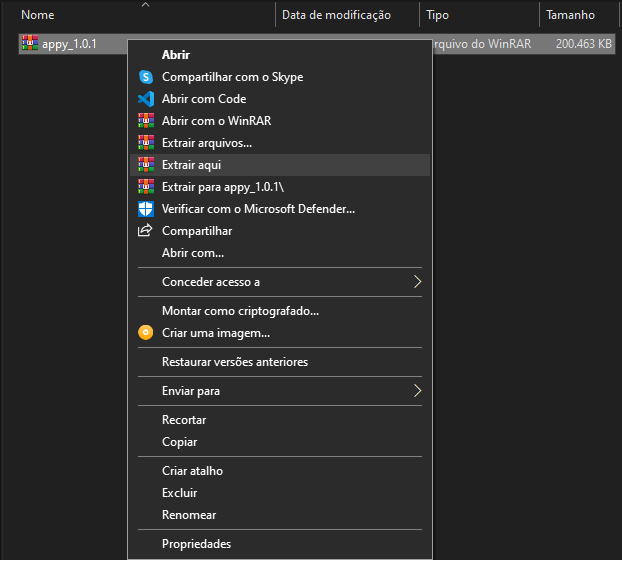
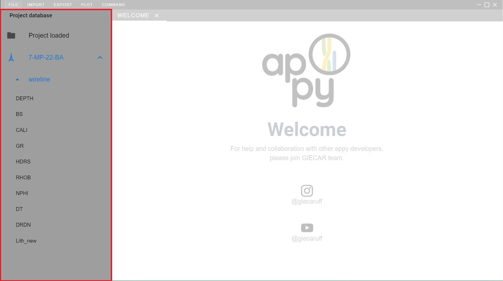
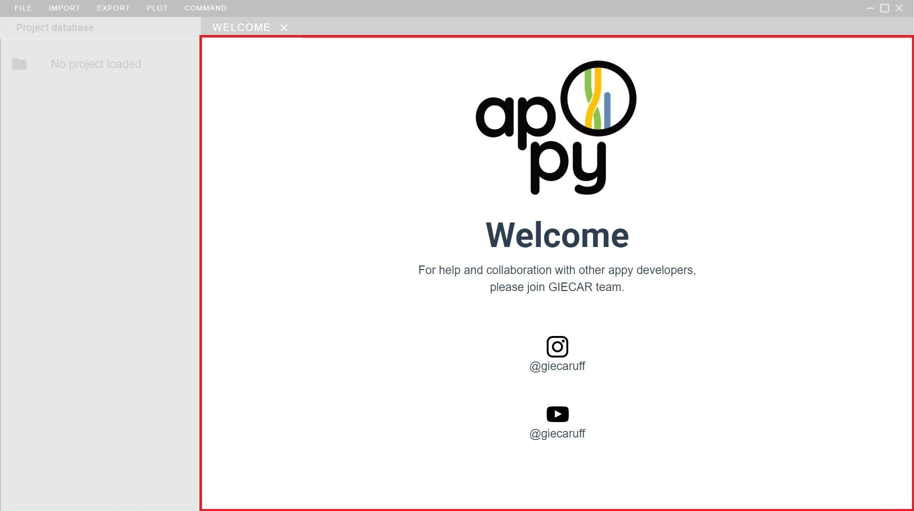

# Capítulo 1 - Primeiros passos no appy

Esse capítulo exemplifica como fazer o _download_ e a instalação do
appy. Em seguida, descreve algumas funcionalidades básicas da interface
gráfica.

Objetivos:

- _Download_ do appy;

- Instalação do appy;

- Resumo básico da interface gráfica do appy;

## 1.1 Realizando o download do appy

Existem duas formas de se obter o instalador do appy, sendo a primeira
por meio da pasta compartilhada do Google Drive, e a segunda a partir da
página do GIECAR no GitHub.

### 1.1.1 Google Drive

**Passo 1:** Acessar a pasta
[releases](https://drive.google.com/drive/folders/1SoTH8_St27u3s_d1_TXK6QwWQHECKO1C?usp=sharing).

**Passo 2:** Selecionar a versão mais recente e clicar com botão
direito.

**Passo 3:** Clicar no botão de "Download", para executar o download.

### 1.1.2 GitHub

## 1.2 Instalando o appy

**Passo 1:** Extrair o arquivo compactado obtido por meio do download
para qualquer diretório desejado.

**Passo 2:** Acessar a pasta "appy" criada.

**Passo 3:** Executar o arquivo "appy Setup 1.0.1".

**Passo 4:** Aguarde até que seja finalizada a instalação. Será criado
um atalho na Área de Trabalho e o appy será iniciado automaticamente.

## 1.3 Interface gráfica do appy

A interface gráfica do appy consiste nos seguintes componentes que serão
descritos a seguir:

- Menu principal: onde é acessado todos os comandos do appy.

- Menu lateral: onde é visualizado todas as informações do projeto
  carregado.

- Sistemas de abas: para navegar entre as diferentes visualizações.

- Área de visualização: área onde os objetos são apresentados, como os
  logplots e crossplots.

### 1.3.1 Menu principal

O menu principal do appy é localizado no topo da janela. Clicando em
cada botão do menu é visualizado o submenu correspondente. Os ícones na
extremidade direita do menu possibilita o appy ser minimizado,
maximizado e encerrado, respectivamente.

O menu principal inclui:

- File: para manipular os projetos.

- Import: para importar dados para o projeto carregado.

- Export: para exportar dados do projeto carregado.

- Plot: para criar visualizações, como os logplots e crossplots.

- Command: para executar comandos, como os cálculos petrofísicos.

### 1.3.2 Menu lateral

O menu lateral é localizado na parte esquerda da janela. O menu lateral
permite ao usuário interpretar os dados do projeto carregado por meio de
uma interface em formato de "árvore". Nessa versão do software, só é
possível visualizar as informações a respeito do poços importados, como
os grupos de perfis e os próprios perfis presentes nesses grupos.

### 1.3.3 Sistema de abas

O sistema de abas é localizado logo acima da área de visualização. É
responsável por apresentar todas as janelas abertas e clicando em cada
título é possível mover entre as diferentes visualizações. Clicando no
ícone do X, é possível fechar aquela janela em particular.

### 1.3.4 Área de visualização

A área de visualização é o componente principal do appy. Todos os
objetos criados a partir do resultado da execução de comandos são
apresentados nessa área, como por exemplo, logplots e crossplots.

